# 🍽️ Restaurant Management System (PHP & MySQL)

A comprehensive **Restaurant Management System** built using **PHP and MySQL**, featuring a **heritage-inspired restaurant design** and **multi-role user management**.\
This system streamlines restaurant operations such as menu handling, order processing, and customer feedback while providing role-based dashboards.

## 🌟 Project Overview

**S & S Heritage Restaurant Management System** is designed to simulate a real-world restaurant workflow with separate access for **Admin, Employee, and Customer** users.
The interface reflects a traditional heritage ambiance while maintaining modern usability.

## 🚀 Features
**✅ Core Features**

- **Home Page**

  - Heritage-themed landing page highlighting ambiance and hospitality

- **Dynamic Navigation Bar**

  - Menu links change automatically based on login status

  - Includes: Home, Menu, About Us, Reviews, Dashboard, Login/Logout

- **Menu Management**

  - **Categorized items:**

    - 🍛 Meals

    - 🍔 Fast Food

    - 🥤 Drinks

    - 🍰 Desserts

  - **User Role Management:**

     - 👑 Admin

     - 👨‍🍳 Employee

     - 👤 Customer

  - **Order Management System:**

    - Customers can place orders

    - Admin can update order status:

       - Pending → Cooking → Served

  - **Customer Reviews**

     - Customers can leave feedback

     - Reviews displayed publicly

  - **Role-Based Dashboards**

     - Separate dashboards for Admin, Employee, and Customer

## 🛠️ Technologies Used

  - **Frontend:** HTML, CSS, Bootstrap

  - **Backend:** PHP

  - **Database:** MySQL

  - **Server:** XAMPP / WAMP

## ⚙️ Installation & Setup
 - **1️⃣ Clone the Repository**

       git clone <repository-url>

 - **2️⃣ Setup Local Server**

    - Install XAMPP or WAMP

    - Start Apache and MySQL

 - **3️⃣ Database Initialization**

    - Open your browser and navigate to:

          http://localhost/Restaurant-Management-System/setup.php

✅ This script will:

  - Create the database automatically

  - Create required tables:

    - users

    - menu_items

    - orders

    - reviews

 - Insert default data (admin, staff, customer, and sample menu items)

## 📄 License

© 2026 **S & S Heritage Restaurant** || 
All rights reserved.

## 🙌 Author

**A.S.M. Sium**\
Web Developer & Software Engineering Student\
📸 Photographer | 💻 PHP & Web Enthusiast

## 👀 Project Preview
**🏠 Home Page**

Heritage-inspired landing page showcasing the restaurant’s ambiance and hospitality.
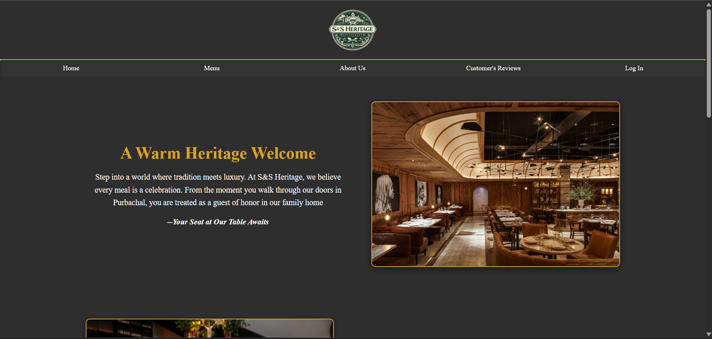

**🏠 About Page**

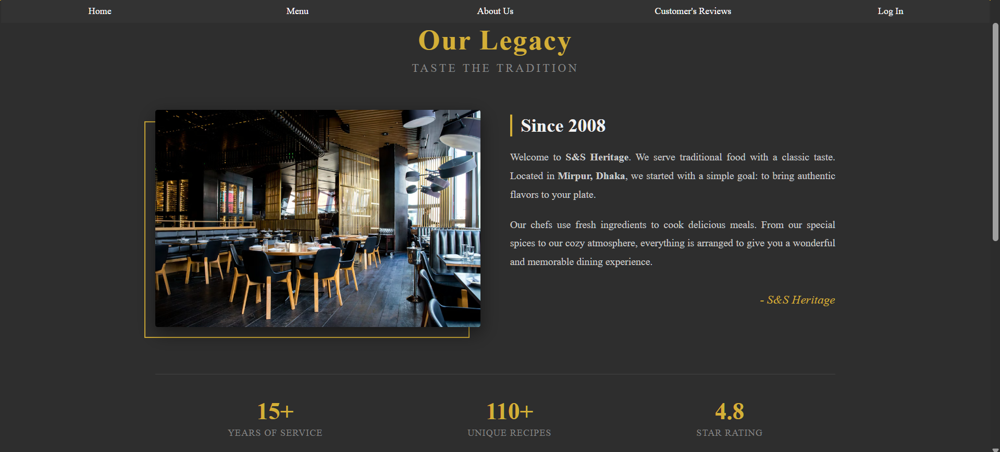

**📋 Menu Page**

 - Categorized food items for easy browsing:

   - Meals

   - Fast Food

   - Drinks

   - Desserts

  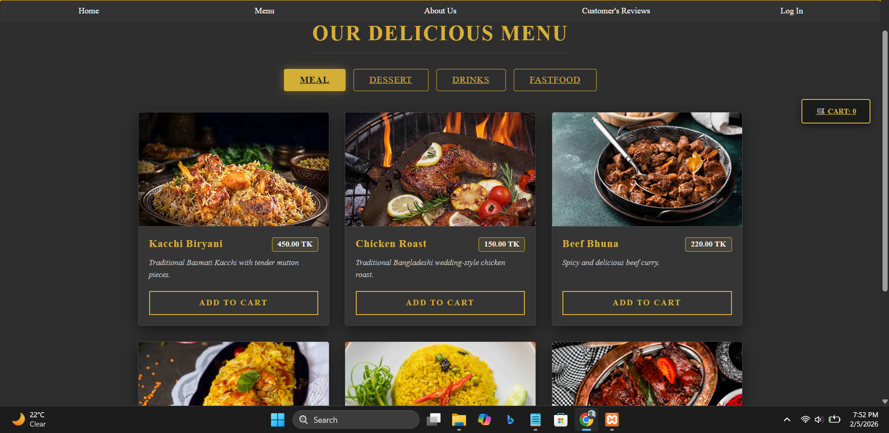
  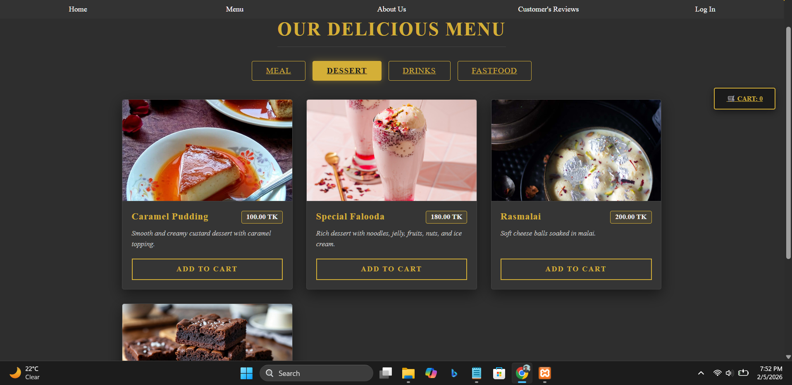
  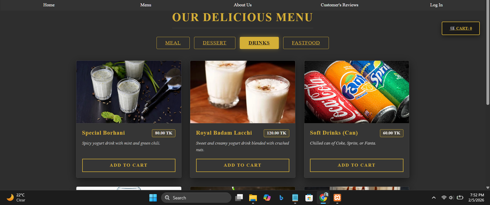
  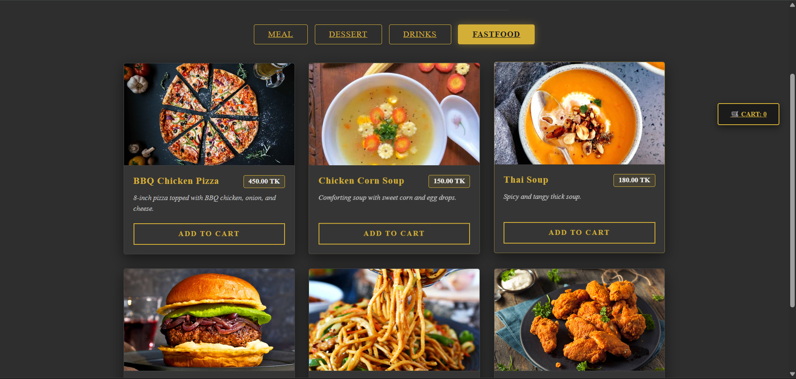

**👤 User Authentication**

  - Login system with role-based access:

     - Admin

     - Employee

     - Customer

  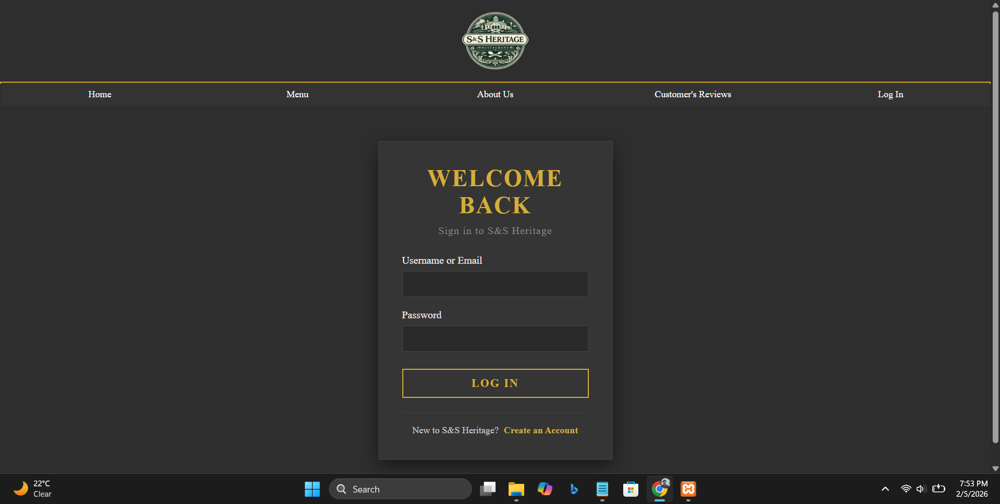

**👤 User Registration**

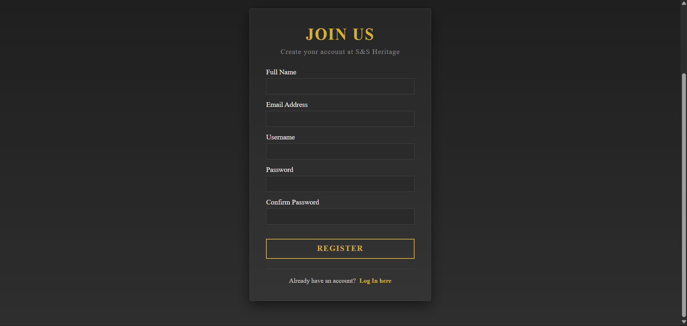

**👤 Admin Dashboard**

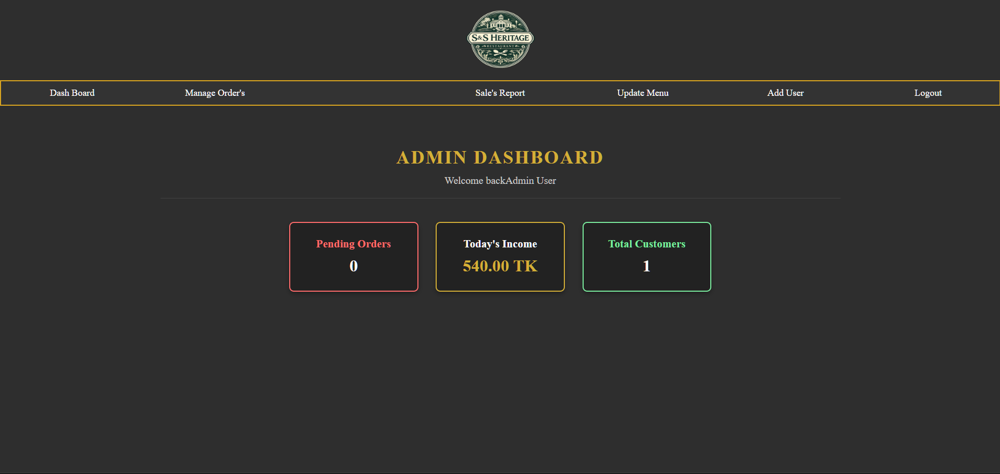
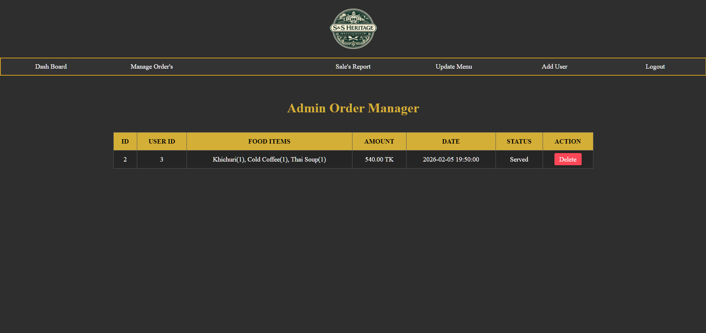
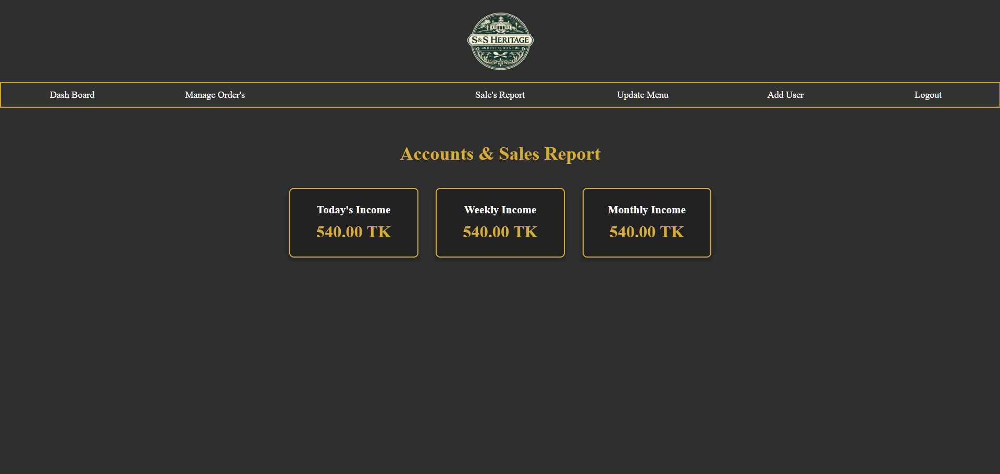
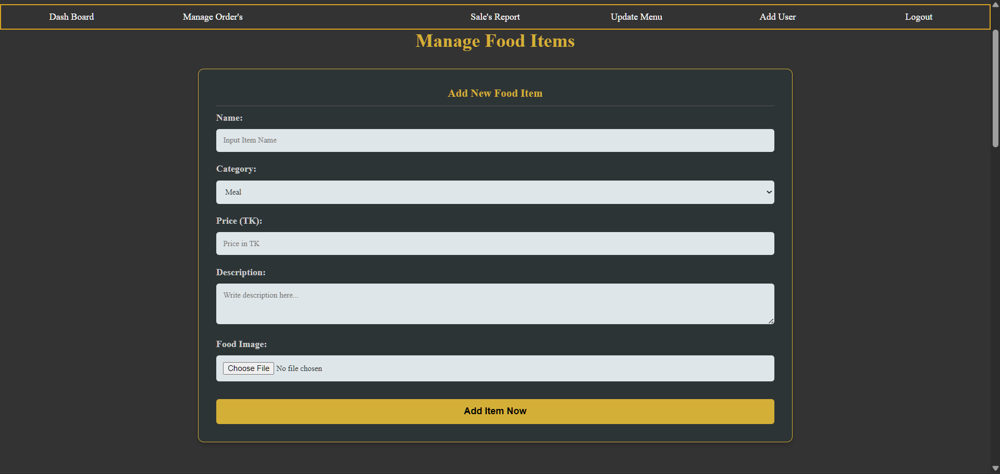
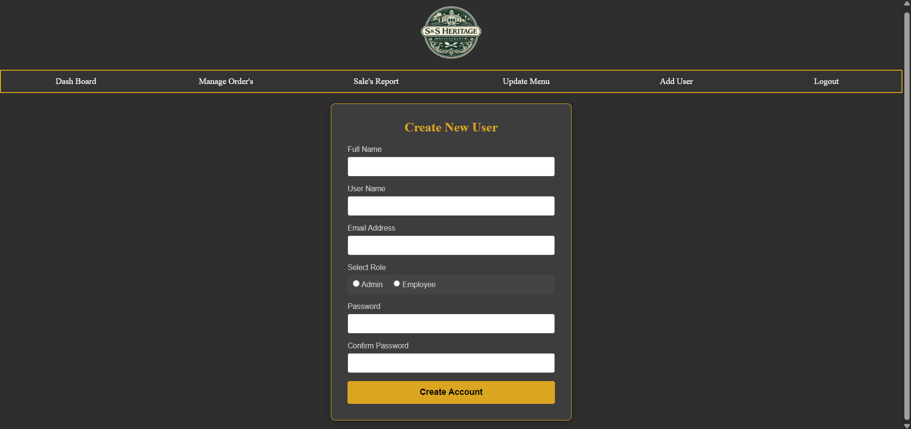

**👤 Employee Dashboard**

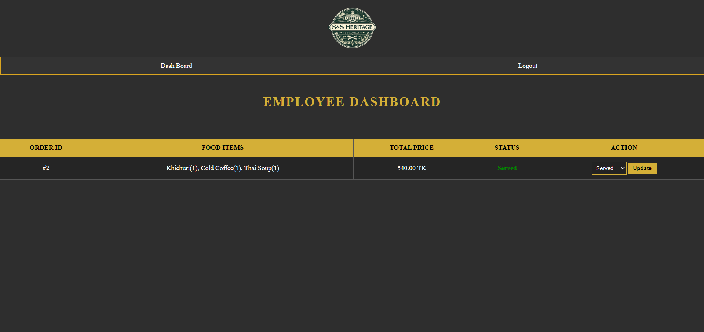

**👤 Customer Dashboard & Review**

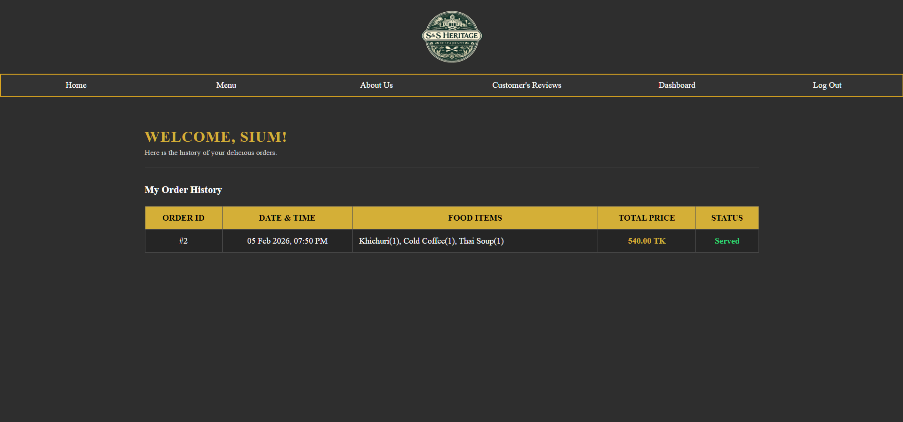
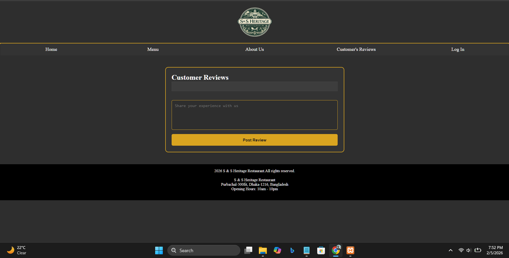
